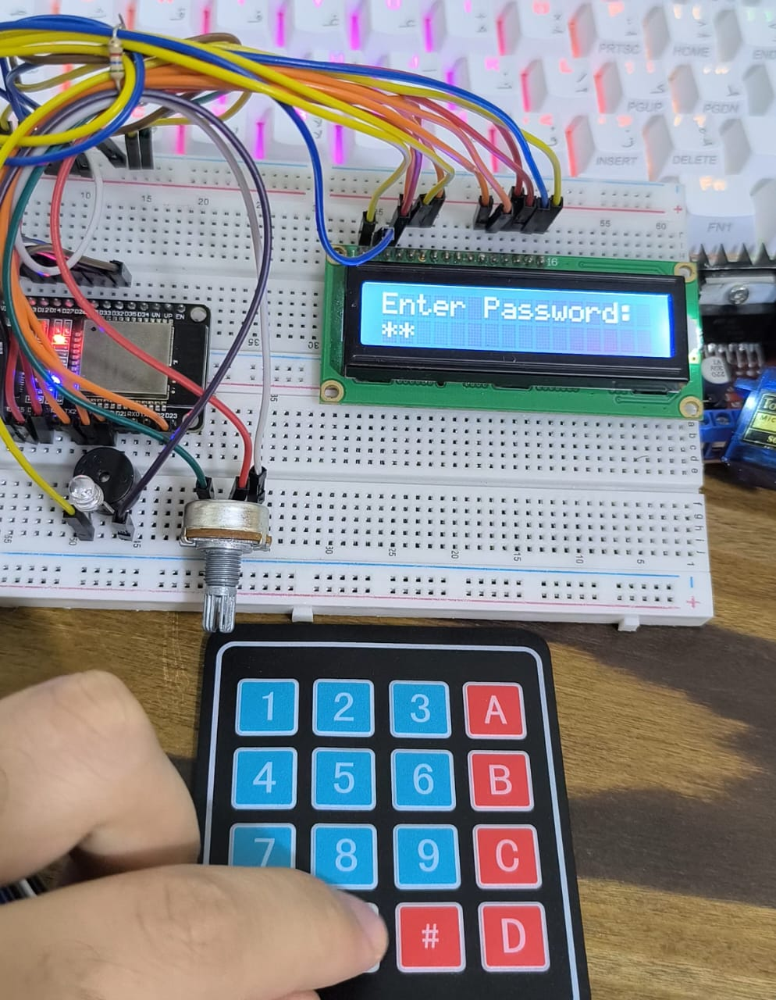
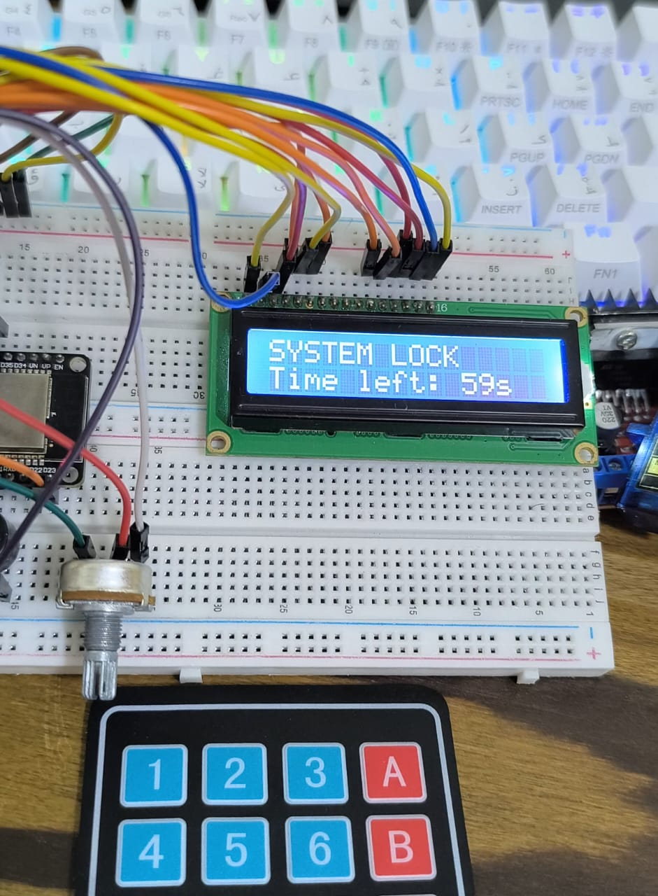
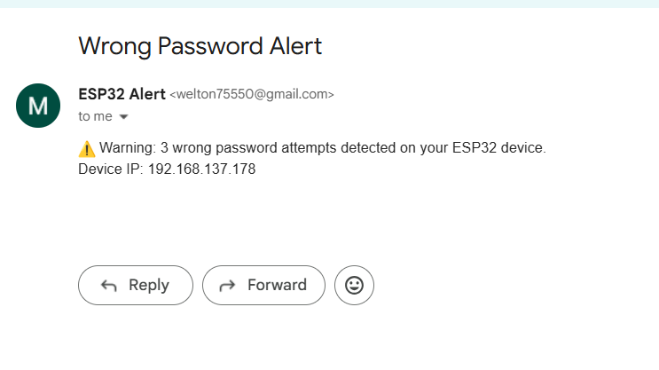

# 💡 ESP32 Password-Protected Security System with Email Alert


An ESP32-based security system that uses a **keypad** and **LCD** for password entry, triggers a **buzzer** on wrong attempts, and sends an **email alert** if the maximum number of incorrect attempts is reached.

---

[ Keypad Input ] ⇄ [ LCD Display ] ⇄ [ ESP32 Logic + Buzzer ] ⇄ [ Email Alert ]

---

## ⚙️ Hardware Components

| Component    | Description                          |
| ------------ | ------------------------------------ |
| ESP32        | Wi-Fi enabled microcontroller        |
| 4x4 Keypad   | For password input                   |
| LCD (16x2)   | Displays messages and countdown      |
| Buzzer       | Audible feedback for success/failure |
| Jumper Wires | For connections                      |
| Breadboard   | Optional for prototyping             |

---

## 🪛 Circuit Connection

| Component      | ESP32 Pin      |
| -------------- | -------------- |
| LCD RS         | 19             |
| LCD EN         | 23             |
| LCD D4         | 18             |
| LCD D5         | 5              |
| LCD D6         | 4              |
| LCD D7         | 2              |
| Keypad Rows    | 13, 12, 14, 27 |
| Keypad Columns | 26, 25, 33, 32 |
| Buzzer         | 15             |

> ⚠️ **Note:** Double-check wiring. Always power off before making connections. Test with low voltage components first.

---

## 🧩 Software Setup

### 1️⃣ ESP32 Arduino Setup

1. Open Arduino IDE and select the correct board (ESP32 Dev Module) and port.
2. Install the following libraries via Library Manager:

   * `Keypad`
   * `LiquidCrystal`
   * `ESP_Mail_Client`
3. Open `ESP32_Code/security_system.ino`
4. Replace placeholders with your Wi-Fi and Gmail credentials:

   ```cpp
   const char* ssid = "YOUR_WIFI_SSID";
   const char* wifiPassword = "YOUR_WIFI_PASSWORD";
   #define EMAIL_SENDER "YOUR_EMAIL@gmail.com"
   #define EMAIL_PASSWORD "YOUR_APP_PASSWORD"
   #define EMAIL_RECIPIENT "RECIPIENT_EMAIL@gmail.com"
   ```
5. Upload the code to your ESP32.

---

## 📡 How It Works

1. User enters password via **keypad**.
2. **LCD** shows feedback:

   * "Enter Password:"
   * "Wrong Password" on failure
   * "Welcome" on success
3. **Buzzer** sounds differently for success or failure.
4. After **3 wrong attempts**, ESP32 locks input for 60 seconds and sends an **email alert** with device IP.

---

## 🔒 Security Notes

* **Never commit real credentials** to GitHub.
* Use **app passwords** for Gmail (two-factor authentication recommended).
* Ensure Wi-Fi is stable for email alerts.
* Avoid exposing hardware to mains power; keep it low-voltage for testing.

---

## 🧠 Future Improvements

* Add **web dashboard** for monitoring attempts.
* Integrate **Bluetooth** for mobile notifications.
* Expand to multiple users with different passwords.
* Use **encryption** for secure password storage.

---

## 📜 License

This project is licensed under the **MIT License** — see the `LICENSE` file.

---

### 👨‍💻 Developed by weLTon

✨ "Smart Security, Made Simple."

---

## 📸 Project Demonstration

### 🔹 LCD & Keypad Interaction

Enter the password and see real-time feedback on the LCD.



---

### 🔹 Wrong Attempt Lock

After 3 wrong attempts, system locks for 60 seconds and triggers email alert.



---

### 🔹 Email Notification

Shows the email received on maximum failed attempts.



---

✨ **Everything working together — from keypad input to ESP32 security logic and email alerts!**
